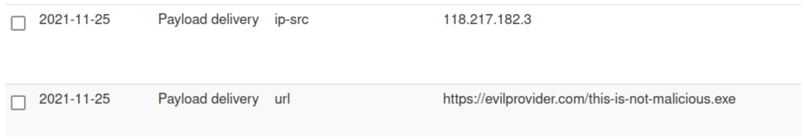
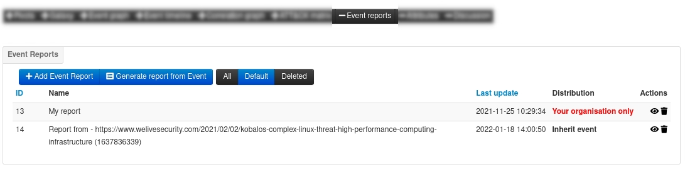

# MISP: Introduction, Concepts and Guide

## Structure of this document 

1. **MISP Introduction**: The what, why and how about MISP
2. **MISP Basics**: A concise introduction to MISP data model
3. **How-to**: A user guide with screenshots on how to use MISP to encode and share data

## MISP Introduction

### What is MISP

MISP is an open-source threat-intelligence and sharing platform meant to store, correlate, enrich, analyse and share information. It enables the various type of analysts to collaborate on investigations and incidents, perform intelligence as well as helping operators to automatically feed their protective tools.

### Why is MISP relevant

Information sharing is becoming more essential than ever to oppose threats. MISP strive to be the enabler and interface for real cross-sectorial sharing and support the organisations facing hybrid threats.
To achieve these goals, MISP uses a practical information sharing format expressed in JSON which is built from a practical use-cases. It is flexible and can be easily extended by users to model their own data-structure.

The MISP core format as well as the common set of vocabularies provided by the various librairies supported by the tool allows users from all around the world to understand each others and rely on normalized data, making MISP a central place to collaborate.

MISP offers different alternatives to share analysis, case and report enabling users to review data produced by partners or third-parties and propose changes if need be. This happens in a decentralized way where analyst can evaluate correaltion against other existing evidences and perform enrichment on the data. 

These functionnalities provide the means to fulfill the ultimate goal of MISP: Bridging communities together.
By fostering communication and sharing accross multiple sectors, people are able to share and collaborate seemlessly making the connection between law enforcement with CSIRTs possible.

### MISP philosophy
Sharing being the principal functionnality, it is essential that everyone is able to send and receive data. As such, everyone is considered to be a producer (also called contributor) and/or a consumer at the same time. There are stricly no obligation to contribute which in turns makes the system to have a low barrier of access for users to get acquainted to the system.

## MISP Basics

A cheat-sheet describing the core concepts and data-models in MISP is available [here](https://www.misp-project.org/misp-training/cheatsheet.pdf).

### 1.1 Data Layer

First and foremost, it’s important to understand how MISP is organised. Similar to all applications, some predefined data structure exists and are used to represent and save the actual data on the disk. Such structure in MISP could be for example *Attributes* or *MISP Objects*.

#### MISP Attributes
*Attributes* are individual block containing the very information to be used or to be shared. Thanks to their characteristic called `type`, *Attributes* can represent concept such as an IP address, a domain name or cryptographic hash. In addition to having a `type` and a `value`, they can express if they are Indicators of Compromise (IoC) or supporting data where for example, the former could be a hash of a malicious binary and the later could be Observed behaviour or links toward documentation. The differentiation between IoC and observable can be done by flipping the *Attribute*'s `to_ids` flag.

#### MISP Objects
In most of the case, these individual blocks of information can be combined together into a more elaborated concept. When multiple *Attributes* are grouped, they form another entity that is called a *MISP Object*. For example, a *File Object* contains multiple *Attributes* such as the filename, its size, its name and so on.

By their very nature, *MISP Objects* organise and facilitate the reading of data in the application. But their efficiency can be improved even more when you add the capability to link them together with relationships to create directed graph allowing to represent stories, processes or behaviours. In MISP, creating such connections is called "create an *Object Reference*". Viewing these relationships as a connected graph can be done by looking at the widget called *Event Graph*.

#### MISP Events

Now that we have the structures to encode information, we need another structure to be able to group them together in order to avoid dealing with a soup of *Attributes* and *MISP Objects*. *MISP Events* or commonly called *Events* are envelopes allowing to assemble *Attributes* and *Objects* contextually linked. Typically, *Events* are used to encode incidents, events or reports.

#### Threat Intelligence Tools: Event Graph, Event Timeline and Event Reports

##### MISP Event Graph

The MISP *Event Graph* feature is a widget accessible when viewing an *Event*. It allows analysts to visualise or create relationships between different entities in order to describe in a concise manner complex scenarios such as events performed in parallel or multiple-step attacks.

##### MISP Event Timeline

In some situation, temporality is crucial to understand the order of events, actions or processes. To help analysts visualise and adjust the time component of *Attributes* or *Objects*, a complete timline viewer and editor is available allowing users to describe complex time-based information.

##### MISP Event Reports

In addition to encode data into pre-formatted structure, MISP offers a tool to write report. Such report are called *Events reports* and are contained in an *Event* where they use the markdown syntax to write formatted text. They also provide directives specific to MISP allowing writers to reference other entities contained in the *Event*. This extended syntax supports referencing *Attributes*, *Objects*, *Tags* and *Galaxy Clusters*.

### 1.2 Context Layer

One of the most critical aspects often left aside is contextualisation. If done properly, it allows the reader to know more about where this data comes from, what it is about, how relevant it is for the user and finally, what can be done with it.

In MISP, contextualising data is as simple as attaching a label to the relevant entity. However, choosing the right labels is the difficult part. We can distinguish two types of labels: *Tags* and *Galaxy Clusters*.

#### Tags

*Tags* are simple labels coming from a curated list of vocabulary (Also called [*Taxonomy*](https://github.com/MISP/misp-taxonomies)). They are mainly used to classify data in order to ease data consumption and automation. For example, the following *Tags* can be used to quickly classify information:
- [`tlp`](https://github.com/MISP/misp-taxonomies/blob/main/tlp/machinetag.json): Allow a favorable classification scheme for sharing sensitive information while keeping the control over its distribution at the same time.
- [`adversary`](https://github.com/MISP/misp-taxonomies/blob/main/adversary/machinetag.json): An overview and description of the adversary infrastructure and allowed actions
- [`collaborative-intelligence`](https://github.com/MISP/misp-taxonomies/blob/main/collaborative-intelligence/machinetag.json): Common language to support analysts to perform their analysis. The objective of this language is to advance collaborative analysis and to share earlier than later.
- [`estimative-language`](https://github.com/MISP/misp-taxonomies/blob/main/estimative-language/machinetag.json): Estimative language to describe quality and credibility of underlying sources, data, and methodologies

#### Galaxy Clusters

*Galaxy Clusters* are knowledge base items having descriptions, links, synonyms and any other meta-information. *Clusters* are regrouped into a higher-level structure called *Galaxy*. *Clusters* enable analysts to assign complex high-level contextual information to data-structures. Example of *Galaxy Clusters*:

- `threat-actor="Sofacy"` having information such as suspected-state-sponsor, victims, links-to-documentation, target-category and synonyms.
- `country="Luxembourg"` having information such as country-code, languages, TLD, Capital and so on.

##### MITRE's ATT&CK

Another advantage that *Galaxy Clusters* have compared to simple labels is the fact that the list of *Clusters* belonging to the same *Galaxy* can be arranged as a matrix to have improved readability and aggregation. One of the biggest success of this kind of matrices is definitely the MITRE ATT&CK framework. It describes tacticts, techniques and procedures of adversaries. ATT&CK is very popular and its usage is highly recommanded as it offers very precise classification and is globally understood and supported by other tools.

### 1.3 Anatomy of a complete Event

### 1.4 Distribution Levels

Distribution level is the term used in MISP to determine who can read which data and how it should be shared. The distribution can be set on entities such as *Event* or *Attributes*, where the most restrictive priority will always take priority.

There are 5 distribution levels controlling who can see and how it should be shared:
- **Organisation only**: Only members of your organisation
- **This Community**: Organisations on one MISP instance
- **Connected Community**: Organisations on one MISP instance and those on MISP instances synchronising with this one. Upon receiving data, the distribution will be downgraded to *This community* to avoid further propagation
    
- **All Community**: Anyone having access. Data will be freely propagated in the network of connected MISP instances
    
- **Sharing Groups**: Distribution list that exhaustively keeps track of which organisations can access the data and to which server it should be synchronised
    

### 1.5 Synchronisation

In MISP, a synchronisation is the act of sharing data from one MISP to another. It can be done with two mechanisms, namely *push* and *pull*. The fact of an instance sending data to another is called *pushing*. If one instance retrieve data from another, it is called *pulling*.

The diagram below shows a one-way synchronisation link between two MISP instances. The Organisation 
$\alpha$ created a *sync_user* (denoted with a $+$) on MISP 2. A synchronisation link can be created on MISP 1 using the API Key and the orgasation of the *sync_user*. At that point, MISP 1 can *pull* data from MISP 2 and can *push* data to MISP 2.

Once a synchronisation link exists *Events* can flow through that connection if and only if the distribution level of the *Event* allows it and if the *Event* is published.

### 1.6 Correlation

A *correlation* is a link between two *Attributes* that are created automatically. They allow interconnection between *Events* based on the correlation *Attribute*'s value. The sytem responsible to create these links is called the correlation engine and support not only strict string comparison but also more clever data type such as CIDR blocks and Fuzzy hashing like SSDEEP.

The correlation system is a tool meant for analysts to corroborate findings and gauge the trustiness of the data. It allows to confirm certain aspect of a report or to find new or unknown threats.

## How-to

### Create an Event

1. On the top-bar, click on `Event Action` then `Add Event`
2. Choose the correct distribution
3. Fill the `Event info` field with a concise summary of what this *Event* is about
4. Fill the remaining optional fields
5. Click on `Submit`

### Create an Attribute

1. When viewing an *Event*, click on `Add Attribute`
2. Fill the required `Category`, `Type` and `Value` field
3. Check `For Intrusion Detection System` checkbox if you consider this *Attribute* to be an indicator
4. Fill the remaining optional fields
5. Click on `Submit`

### Create an Object

1. When viewing an *Event*, click on `Add Object`
2. If you know the category of the *Object*, select it, otherwise pick `All Objects`
3. To add a "File" *Object*, search the entry in the dropdown or start typing `file` then select the entry
4. Fill out at least the requirements for this Object and additional other *Attributes*
5. Click on `Submit`
6. Review the *Object* you are about to create then it `Create new object`

### Create an Relationship

1. To create a relationship or *Reference*, a user can either click on the plus button from the *Object* table or do it directly from the *Event Graph*
2. On the *Event Graph*, click on `Edit` then drag an arrow from the first *Object* to another entity
3. On the `Add Object Reference` box, select which verb should be use to describe the relationship in the `Relationship type` input
    - Note: If you want to use a verb not present in the list, use the `custom` entry
4. Click on `Submit` 

### Create an Event Report

1. When viewing an *Event*, click on the toggle button `Event reports` 
2. Click on `Add Event Report` and enter the name of the report. As its content can be written with more ease in the dedicated editor, leave it empty and click on `Submit` 
3. Once the list has reloaded, click on the *Event Report* that was created, then on the `Edit report` button 
4. Write the report in the editor 
    - Note: The `Help` button contains documentation about the supported markdown syntax and how to reference *Attributes*, *Objects* and context. 
5. Once you are done, click the `Save` button 

### Add Tags

1. *Tags* can be attached to both *Events* and *Attributes* with the following buttons: 
2. To tag the *Event* or the *Attribute* globally, click on the button with the globe icon 
3. Select the *Taxonomy* in which the tag is part of or click on `All Tags` 
4. Pick the tag then click on `Submit` 

### Add Galaxy Clusters

1. Similar to tags, *Galaxy Clusters* can be attached with the button with the globe icon 
2. To tag the *Event* or the *Attribute* globally, click on the button with the globe icon 
3. Select the namespace in the *Galaxy* is part of or click on `All namespaces` 
4. Select the *Galaxy* in which the *Cluster* is part of or click on `All Clusters` 
5. Pick the *Cluster* then click on `Submit` 

### Publish

1. Whenever an *Event* is to be shared, it has to be be Published 
2. When viewing an *Event*, click on the `Publish` button located on the sidebar 

