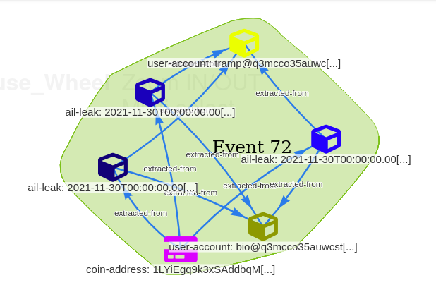

# Setting up the lab
This lab assume the trainees have a working LXC/LXD 

## MISP

Use the AIL instances provided by your trainer.

## AIL

Use the AIL instances provided by your trainer.
Credentials are in the form:
```
user-*@ecteg.eu:leECTEG2022
```
with `*` being a number between `0` and the number of users your trainer created.

# Exploring the dataset
Visit the `Objects` tab and check out for the relevant timerange:
- PGP keys,
- Cryptocurrencies,
- Username.
Use the graph view to visit items. 

# Exporting specific conversations 
Now that we know there are some intersections with an existing event, we will bring more context about the bitcoin address that was already known.
- Go back to AIL and find the intersecting address,
- Export this bitcoin address, along with the related items and usernames. How many levels should you export?
- Once exported, go back to MISP to check out the result.

# Extending Previous MISP event
- In order to link data from both events, we extends the oldest event by the new one. Once done, you should obtain a similar `Event Graph` to this picture:



# Writing an event report
- Write an event report in the extending event explaining your findings.

# Remarks
- The matching MISP event is ficticious and has been created solely for its pedagogical value.