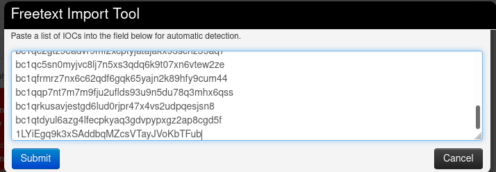

# Setting up the lab
This lab assume the trainees have a working LXC/LXD 

## MISP
- Import the provided MISP lxc container:

``` lxc image import 0720fcca01da6257810f76359e5b125add8186bb30ac7552d01244ef95f4043d.tar.gz --alias fresh-misp```
``` lxc launch fresh-misp misp01```
- You can check the newly created container, along with its IP address with:
`lxc list`
- Access MISP with a web browser: `https://thecontaineripaddress`
and change the password as required
- Go into `Administration`>`List Auth Keys` and create a new authentication key. Note it down, you will need it later.


## AIL

- Import the provided AIL lxc container:

``` lxc image import .9f7f3b1504c12ef6d3ddf6748f735ba1c2b9f16d5d2c7b1d7ea7b5b4c9ee5b0d.tar.gz --alias conti-ail```
``` lxc launch conti-ail ail01```
- You can check the newly created container, along with its IP address with:
`lxc list`
- Open a terminal in the newly created container with:
```lxc exec ail01 -- su --login ail```
- Once in the container, launch AIL:
```bash
$ cd ail-framework/bin
$ ./LAUNCH -l
```
- Access AIL with a web browser: `https://thecontaineripaddress:7000`
- Credentials are `admin@admin.test:leECTEG2022`


## MISP and AIL interactions
In order for AIL to be able to export data into the MISP instance, we have to provide some information on the file `ail-framework/configs/keys/mispKEYS.py`
We create it by copying the sample config file:
```
cd ail-framework/configs/keys
cp mispKEYS.py.sample mispKEYS.py
```
The edit the file with `vim mipsKEYS.py`:
```
# add misp container url
misp_url = 'http://'
# add misp API key
misp_key = ''
# disable cert verification
misp_verifycert = False
```
Relaunch AIL in order for the changes to take effect:
```
~/ail-framework/bin$ ./LAUNCH.sh -k
~/ail-framework/bin$ ./LAUNCH.sh -l
```
# Feeding AIL with Conti jabber chats data
This image contains november 2021 translated conti chats in `~/conti-ransomware-leak`, along with a script `feeder.py` that will push this data into your AIL instance.

This script need the correct AIL API key, you can create one or use the admin's. API are listed for each user in `Server Management`>`Users List`.

Run the feeder by using the following procedure:
```bash
ail@mytraining:~$ . ./venv/bin/activate
ail@mytraining:~$ cat ./conti-ransomware-leak/* | jq -c . | python feeder.py
```
Waiting until the scripts finishes. 
AIL starts ingesting and analyzing the data:


# Exploring the dataset
Visit the `Objects` tab and check out for the relevant timerange:
- PGP keys,
- Cryptocurrencies,
- Username.
Use the graph view to visit items. 

# Exporting raw bitcoin addresses 
As we want to cross data contained in our AIL instance with to one contained in our MISP instance, we can again use scripts to interact with AIL:
```bash
# let's deactivate the previous virtual environment to move the AIL's
$ deactivate
$ . ./ail-framework/AILENV/bin/activate
$ python ./ail-framework/tools/extract_cryptocurrency.py -t bitcoin| jq .
```
- Write the correct `jq` select to select bitcoin addresses
- How would you remove the quotes?

Move on to your MISP instance, create an event, and use the free text import tool to populate it:





- Observe correlated events.

# Exporting specific conversations 
Now that we know there are some intersections with an existing event, we will bring more context about the bitcoin address that was already known.
- Go back to AIL and find the intersecting address,
- Export this bitcoin address, along with the related items and usernames. How many levels should you export?
- Once exported, go back to MISP to check out the result.

# Extending Previous MISP event
- In order to link data from both events, we extends the oldest event by the new one. Once done, you should obtain a similar `Event Graph` to this picture:


# Writing an event report
- Write an event report in the extending event explaining your findings.

# Remarks
- The matching MISP event is ficticious and has been created solely for its pedagogical value.