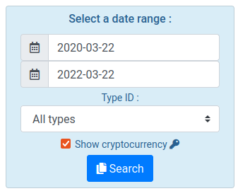
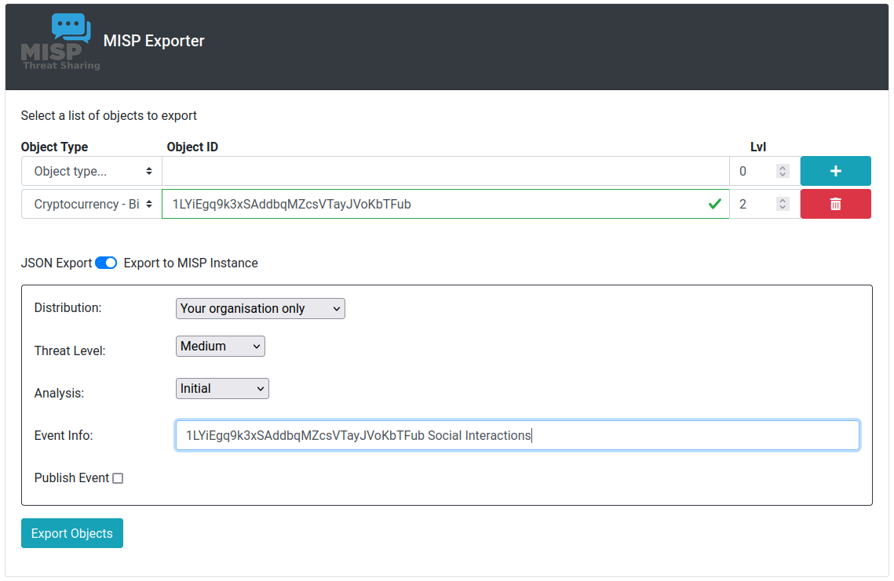
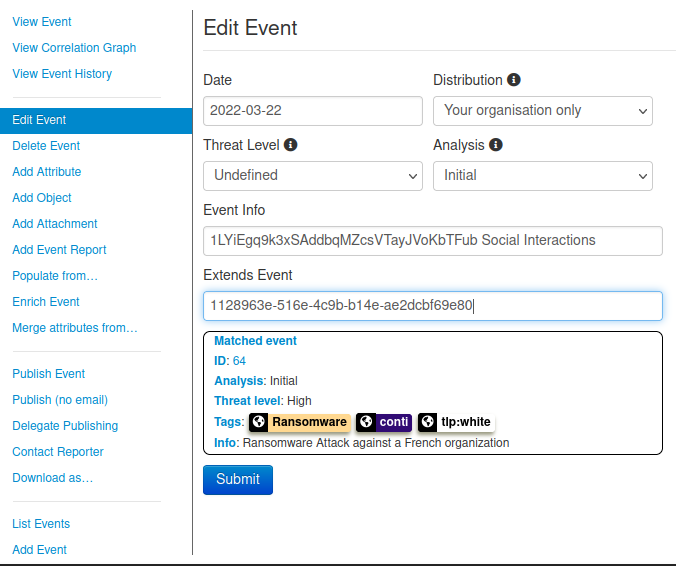
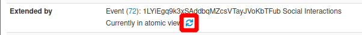
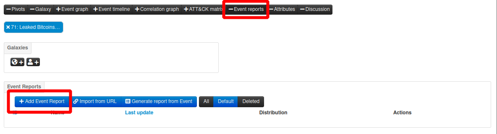

# Creating the main AIL instance:

- Import the provided AIL lxc container:

``` lxc image import 083f03722e491b44659dd50f83a37a0e57de80e20feb8c7f68364e97079ef515.tar.gz --alias conti-full```
Create a new LXC profile `full-conti`:
- Download the [conti-cloud-init](./conti-cloud-init) file,
- create a new `lxc` profile:
```
lcx profile create ail-new-users
```
- input the `conti-cloud-init` file into this profile:
```
cat conti-cloud-init | lxc profile edit ail-new-users
```
- edit the profile to fit your needs, for instance:
```
lxc profile edit ail-new-users
```
  - increase the number of participants to 15: 
```yaml
 - [python, /home/ail/ail-framework/var/www/create_users.py, 15]
```
  - change the storage pool from `zfs` to loopback `zfs`: 
```yaml
  root:
    path: /
    pool: default
    type: disk
```

Once the setting is correct, set up the instance with:

```
lxc launch conti-full ail01 -p ail-new-users
```
- You can check the newly created container, along with its IP address with:
`lxc list`
- The container will be readily available, open a terminal in the newly created container with:
```
lxc exec ail01 -- su --login ail # for ail user
lxc exec ail01 -- bash  # for root
```
- `cloud-init` can take a while to create users, enter `watch cloud-init status` within the container to know when its done.
- the setup is complete, launch AIL as `ail` user:
```bash
$ cd ail-framework/bin
$ ./LAUNCH -l
```
- Access AIL with a web browser: `https://thecontaineripaddress:7000`
- Credentials are `trainer@ecteg.eu:leTRAINERduECTEG2022`

# Exporting specific conversations 
- Go to `Objects`>`Cryptocurrency`,
- Select the right date range, and tick `Show cryptocurrency`,

- Use the Search box to filter results,
- Click on the address `1LYiEgq9k3xSAddbqMZcsVTayJVoKbTFub`
- Select `Add to MISP export`
- Select 2 levels, export to MISP instance.


# Extending Previous MISP event
- In order to extend the oldest event `Ransomware Attack against a French organization`, copy its `uuid`, and edit the newest event to past the `uuid` in the `Extends Event` field:



- Switch between atomic and extended view of the cycling arrows, see below:



# Writing an event report
- extend the newest event `event report` tab and click on `Add Event Report` to create a new event report.



- make sure to write the report in the extending event,
- you may need to go back to the extended event to copy the `uuid` of the object you wish to reference in your report,
- beware that extending event's reports appear in the extended event view when in extended view only.
- `uuid` from this example text will vary from yours.

```
# Background

On Feb. 27th 2022, information popped up on the Internet that a disgruntled UA operator from Conti ransomware gang was about to leak information about their operations in the coming hours on his twitter account @[attribute](2fffcbad-c126-474a-8df6-606254a829df).
External analysis brings more details into this investigation @[attribute](845ae122-4628-47fd-8bb6-94c7f7ba3922)

# Cryptocurrencies wallet used for moving money

When the french orgenization got ransomed, Conti asked for an undisclosed amount of money to be transefered on @[attribute](cf48238c-28e3-44d2-90b4-9c404f0fb889).
The leak brought new information in the form of jabber chats between Contri ransomware opeartors @[object](84ed683d-e46b-43de-9c81-1ee80118e0c7) and the french org, we know now that Conti asked for $1,150,000.

# Analysis

The analysis has been done using AIL.
```