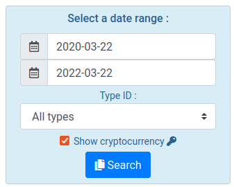
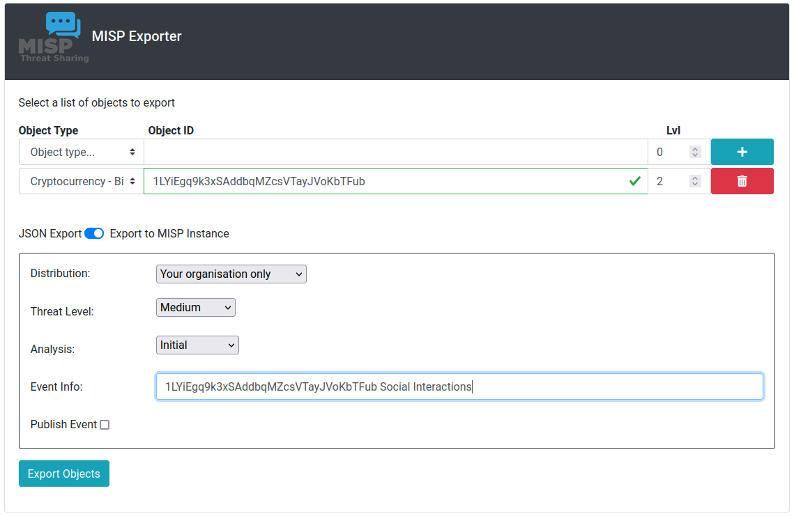
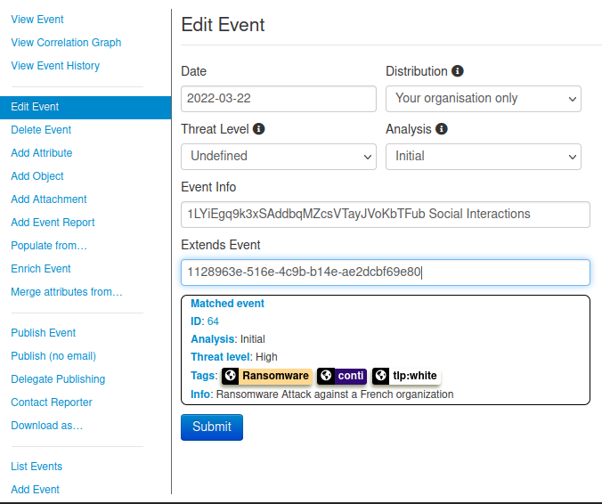
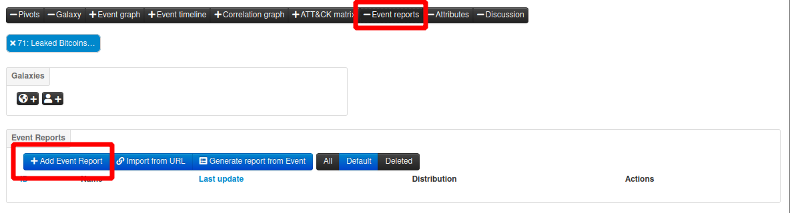

# Additional files for the trainers (to take shortcuts if needed)

- Final MISP event is [available](./files).

# Exporting raw bitcoin addresses 
- the correct `jq` selector is the following: `.[].nodes[0].text`
- to trim quotes, we use `tr`: `tr -d '"'`
- the complete command is:
```bash 
ail@mytraining:~$ python ./ail-framework/tools/extract_cryptocurrency.py -t bitcoin  | jq .[].nodes[0].text | tr -d '"'
```
- Complete list of addresses:
```
12bsh5bc7wkVSRv25Qw6x3JYzuQDpZZ4zi
1LCEGFc6Cwe194B6gavMcZ56o2pbftXqWk
1NqxPMSjDxEfJ2ozbFnGEoumDpL4Z8frKh
32Bg4EsuNjxVJ9ZP2RWHv66ybZRHQotQS4
33i6BL4HGNL7YSdPWDP9x2swdJinNLs5zu
395hQDyiBT16yt8jVVNj7WuZoQ4ouuFJcZ
3CPbvktjKPiWcYu4PM4oVrQhvSQjCKnR59
3ESoHHu87mTrFNSNUaMVEfT3vYwRYGfSHQ
3HrDFf1Yj95PFeSR58kCthga3p9hcz9Nmw
3M9tAMuamLcCpifaCQPSH3Th5F4VwjmyWz
3NAn1bJ49deFB9MmKw1gfBVr5Vwu5KsVzr
3QdNiLEpxKWQ6SoxULAo4xc48d5otumivR
bc1q4hxu7x9jjlx9wqx8sr6pq2gajr786gffgpw3ey
bc1q8qfesjc2slfwe8xv3l0rxwdexms006swf7gcur
bc1qa273a36dgnrdqevnx0lftn99t2we306eu7gm2k
bc1qmdjxd98fnk83l5k8cpvc77f9rljr7942cq0sfz
bc1qptn5qsllcxmrndmwucelazjt0z68zkrgrlumy0
bc1qtn42kyjuz0lc9w9gue72xr9m2a7jgsf3rk2vul
bc1qtnqw53pxxp3j0a7ttuurqzuzxnn66su8svwv6k
bc1qvahawe2w84mgqgspcgx4uyu0vgw6r9y96srcj2
1NVHhVjcPEWdUNpUjb3RaBWPw2WdvZ7JEk
bc1q0q5gsymkvp7vffpuexz0eq5csufxs60npza3ct5
bc1q6gj8ymnjh863gmuvh2nc3462trrvzlxf2atzxn
bc1q7cd8rxvvwuqgeh2ya9vk2ekr9qutthyklzkamf8
bc1qc2gtz9eadvr9mf2xcptyjatajakx93schz35aq7
bc1qc5sn0myjvc8lj7n5xs3qdq6k9t07xn6vtew2ze
bc1qfrmrz7nx6c62qdf6gqk65yajn2k89hfy9cum44
bc1qqp7nt7m7m9fju2uflds93u9n5du78q3mhx6qss
bc1qrkusavjestgd6lud0rjpr47x4vs2udpqesjsn8
bc1qtdyul6azg4lfecpkyaq3gdvpypxgz2ap8cgd5f
1LYiEgq9k3xSAddbqMZcsVTayJVoKbTFub
```
# Exporting specific conversations 
- Go to `Objects`>`Cryptocurrency`,
- Select the right date range, and tick `Show cryptocurrency`,

- Use the Search box to filter results,
- Click on the address `1LYiEgq9k3xSAddbqMZcsVTayJVoKbTFub`
- Select `Add to MISP export`
- Select 2 levels, export to MISP instance.


# Extending Previous MISP event
- In order to extend the oldest event `Ransomware Attack against a French organization`, copy its `uuid`, and edit the newest event to past the `uuid` in the `Extends Event` field:



- Switch between atomic and extended view of the cycling arrows, see below:


# Writing an event report
- extend the newest event `event report` tab and click on `Add Event Report` to create a new event report.



- make sure to write the report in the extending event,
- you may need to go back to the extended event to copy the `uuid` of the object you wish to reference in your report,
- beware that extending event's reports appear in the extended event view when in extended view only.
- `uuid` from this example text will vary from yours.

```
# Background

On Feb. 27th 2022, information popped up on the Internet that a disgruntled UA operator from Conti ransomware gang was about to leak information about their operations in the coming hours on his twitter account @[attribute](2fffcbad-c126-474a-8df6-606254a829df).
External analysis brings more details into this investigation @[attribute](845ae122-4628-47fd-8bb6-94c7f7ba3922)

# Cryptocurrencies wallet used for moving money

When the french orgenization got ransomed, Conti asked for an undisclosed amount of money to be transefered on @[attribute](cf48238c-28e3-44d2-90b4-9c404f0fb889).
The leak brought new information in the form of jabber chats between Contri ransomware opeartors @[object](84ed683d-e46b-43de-9c81-1ee80118e0c7) and the french org, we know now that Conti asked for $1,150,000.

# Analysis

The analysis has been done using AIL.
```